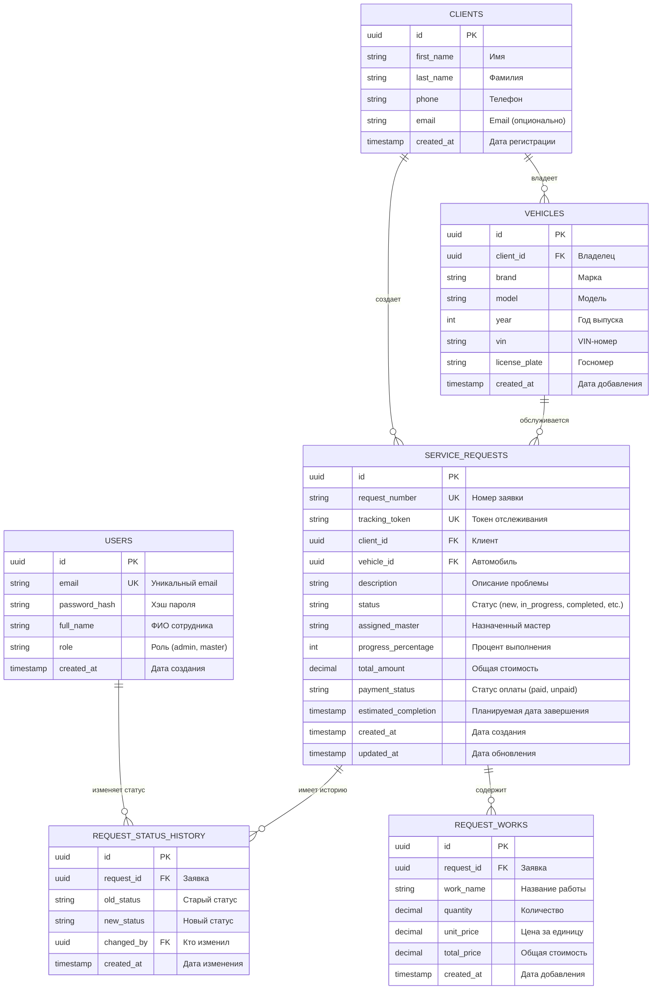

# ERD диаграмма информационной системы "Car Lab"

## Диаграмма сущностей и связей (Entity-Relationship Diagram)

## Описание связей

### 1. CLIENTS → VEHICLES (Один ко многим)
- Один клиент может владеть несколькими автомобилями
- Каждый автомобиль принадлежит одному клиенту
- **Связь**: `VEHICLES.client_id → CLIENTS.id`

### 2. CLIENTS → SERVICE_REQUESTS (Один ко многим)
- Один клиент может создать множество заявок на обслуживание
- Каждая заявка связана с одним клиентом
- **Связь**: `SERVICE_REQUESTS.client_id → CLIENTS.id`

### 3. VEHICLES → SERVICE_REQUESTS (Один ко многим)
- Один автомобиль может иметь множество заявок на обслуживание
- Каждая заявка относится к одному автомобилю
- **Связь**: `SERVICE_REQUESTS.vehicle_id → VEHICLES.id`

### 4. SERVICE_REQUESTS → REQUEST_WORKS (Один ко многим)
- Одна заявка может содержать множество выполняемых работ
- Каждая работа относится к одной заявке
- **Связь**: `REQUEST_WORKS.request_id → SERVICE_REQUESTS.id`
- **Каскадное удаление**: При удалении заявки удаляются все связанные работы

### 5. SERVICE_REQUESTS → REQUEST_STATUS_HISTORY (Один ко многим)
- Одна заявка имеет историю изменений статуса
- Каждая запись истории относится к одной заявке
- **Связь**: `REQUEST_STATUS_HISTORY.request_id → SERVICE_REQUESTS.id`
- **Каскадное удаление**: При удалении заявки удаляется история

### 6. USERS → REQUEST_STATUS_HISTORY (Один ко многим)
- Один пользователь может изменять статусы множества заявок
- Каждое изменение статуса может быть связано с пользователем (опционально)
- **Связь**: `REQUEST_STATUS_HISTORY.changed_by → USERS.id`

## Ключевые поля

### Первичные ключи (PK)
Все таблицы используют UUID в качестве первичного ключа (`id`)

### Внешние ключи (FK)
- `VEHICLES.client_id` → `CLIENTS.id`
- `SERVICE_REQUESTS.client_id` → `CLIENTS.id`
- `SERVICE_REQUESTS.vehicle_id` → `VEHICLES.id`
- `REQUEST_WORKS.request_id` → `SERVICE_REQUESTS.id`
- `REQUEST_STATUS_HISTORY.request_id` → `SERVICE_REQUESTS.id`
- `REQUEST_STATUS_HISTORY.changed_by` → `USERS.id`

### Уникальные ключи (UK)
- `USERS.email` - уникальный email пользователя
- `SERVICE_REQUESTS.request_number` - уникальный номер заявки
- `SERVICE_REQUESTS.tracking_token` - уникальный токен для отслеживания

## Индексы

Для оптимизации производительности созданы индексы на следующих полях:

**VEHICLES**:
- `client_id` - для быстрого поиска автомобилей клиента

**SERVICE_REQUESTS**:
- `status` - для фильтрации по статусу
- `request_number` - для быстрого поиска по номеру
- `tracking_token` - для отслеживания заявки клиентом
- `client_id` - для поиска заявок клиента

**REQUEST_WORKS**:
- `request_id` - для поиска работ по заявке

**REQUEST_STATUS_HISTORY**:
- `request_id` - для получения истории заявки

## Типы данных

### UUID (Универсальный уникальный идентификатор)
Используется для всех первичных ключей, обеспечивает уникальность записей

### Decimal
Используется для денежных полей:
- `total_amount` - Decimal(10, 2) - до 99,999,999.99
- `unit_price`, `total_price` - Decimal(10, 2)
- `quantity` - Decimal(10, 2) - поддержка дробных значений

### Timestamp
Все временные метки включают дату и время с точностью до миллисекунд

### String
Текстовые поля различной длины для хранения имен, описаний, статусов

## Особенности реализации

1. **Автоматическая генерация**:
   - UUID для всех записей
   - Timestamps для `created_at`
   - Автоматическое обновление `updated_at`

2. **Каскадные операции**:
   - Удаление заявки удаляет все связанные работы и историю
   - Связи клиент-автомобиль и клиент-заявка сохраняются

3. **Мягкие связи**:
   - `assigned_master` - строка (имя мастера), не FK
   - `changed_by` - опциональная связь с пользователем

4. **Бизнес-логика**:
   - Автоматический расчет `total_amount` из суммы `REQUEST_WORKS`
   - Отслеживание прогресса через `progress_percentage`
   - История изменений статусов для аудита
